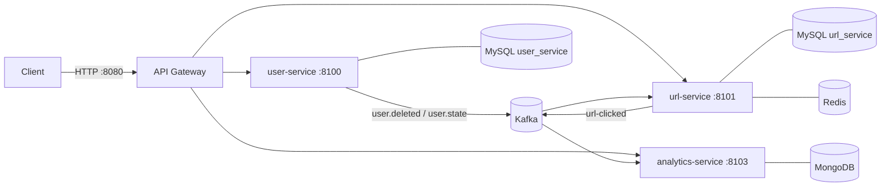

# Scalable URL Shortener

A URL shortener built as a set of Spring Boot microservices. Users sign up with email and password, log in with
JWT, create short links (with optional custom alias, expiry date and password), and see click analytics for their
links. Services talk to each other through events (Apache Kafka).

The main flow is kept simple: **register → login → dashboard → create short URL**.

---

## Table of Contents

- [How It Works](#how-it-works)
- [Services](#services)
- [Tech Stack](#tech-stack)
- [Project Structure](#project-structure)
- [Main Flows](#main-flows)
- [Authentication](#authentication)
- [API Reference](#api-reference)
  - [Response Format](#response-format)
  - [User API](#user-api)
  - [Admin API](#admin-api)
  - [URL API](#url-api)
  - [Redirect](#redirect)
  - [Analytics API](#analytics-api)
  - [Error Codes](#error-codes)
- [Kafka Events](#kafka-events)
- [Running Locally](#running-locally)
- [Configuration](#configuration)
- [Roadmap](#roadmap)

---

## How It Works

Every request from a client goes to the **API Gateway** (port `8080`). The gateway checks the JWT, adds the
user's details as headers, and forwards the request to the right service. Services find each other through
**Eureka** and load their settings from the **Config Server**.



---

## Services

| Service                  | Port   | What it does                                                                                              |
|--------------------------|--------|-----------------------------------------------------------------------------------------------------------|
| **config-server**        | `8600` | Central configuration. Serves the YAML files in `config-server/src/main/resources/configurations/`.       |
| **discovery-server**     | `8500` | Eureka registry. Every service registers here so others can find it by name (e.g. `lb://url-service`).    |
| **api-gateway**          | `8080` | Single entry point. Routes requests, validates the JWT and blocks non-admins from admin routes.           |
| **user-service**         | `8100` | Registration, login, logout, profile, account deletion and admin actions. Uses MySQL.                      |
| **url-service**          | `8101` | Creates, lists, updates and deletes short URLs, and handles redirects. Uses MySQL and a Redis cache.      |
| **analytics-service**    | `8103` | Saves every click (browser, OS, device, referrer) in MongoDB and returns stats per link.                  |
| **common-lib**           | –      | Shared code: Kafka event classes, custom exceptions, `ApiResponse` / `ErrorResponse` and the global error handler. |

---

## Tech Stack

| Category            | Technology                                     |
|---------------------|------------------------------------------------|
| Language            | Java 21                                        |
| Framework           | Spring Boot 4.0.3, Spring Cloud 2025.1.0       |
| API Gateway         | Spring Cloud Gateway (WebFlux)                 |
| Service Discovery   | Netflix Eureka                                 |
| Configuration       | Spring Cloud Config (native / classpath)       |
| Messaging           | Apache Kafka                                   |
| Databases           | MySQL (users, URLs), MongoDB (analytics)       |
| Cache               | Redis (redirect cache)                         |
| Security            | Spring Security, JWT (JJWT 0.13), BCrypt       |
| User-agent parsing  | Yauaa                                          |
| Build               | Maven (multi-module)                           |

---

## Project Structure

```
scalable-url-shortener/
├── pom.xml                  # parent POM: versions for Spring Boot, Spring Cloud, JJWT
├── common-lib/              # shared events, exceptions, response classes
├── config-server/
│   └── src/main/resources/configurations/   # one YAML file per service
├── discovery-server/
├── api-gateway/             # RouteConfig (routes), AuthenticationFilter + JwtService (JWT checks)
├── user-service/            # controller → service → repository, JwtService, cookies
├── url-service/             # UrlController, RedirectController, Redis cache, Kafka consumers
└── analytics-service/       # Kafka consumer + stats endpoint (MongoDB aggregations)
```

Every service follows the same layering: **controller** (HTTP) → **service** (business logic) → **repository**
(database), with **dto** classes for requests/responses and a **mapper** to convert between entities and DTOs.

---

## Main Flows

### 1. Register

`POST /api/v1/user/register` with name, email and password. The password is stored as a BCrypt hash, and the
account is **active straight away**, with no email verification.

### 2. Log in

`POST /api/v1/user/login` checks the password and sets a JWT (valid **1 hour**) in an HttpOnly cookie called
`accessToken`. The token is not in the response body, so page JavaScript can never read it.

### 3. Dashboard

The dashboard needs two calls:

- `GET /api/v1/user/me`: the user's name and email.
- `GET /api/v1/url/my-urls?page=1&size=10`: the user's short links. `totalElements` is the number of links.

Click stats for a link come from `GET /api/v1/analytics/{shortCode}`.

### 4. Create a short URL

1. `POST /api/v1/url/new`: the gateway adds `X-User-Id` from the JWT.
2. If a custom alias was sent, it must be free. Otherwise the short code is the database id in Base62
   (6 characters, e.g. id `1` → `aaaaab`).
3. There is no limit on how many links a user can create.

### 5. Open a short link (redirect)

1. `GET /{shortCode}`: the gateway forwards it to `/api/v1/redirect/{shortCode}` on url-service.
2. url-service looks in Redis first (key `url:short:<code>`, cached for **15 minutes**), then MySQL. If Redis is
   down, it reads from MySQL directly, so links keep working.
3. It checks that the link is active, not expired, and that the password is correct (if it has one).
4. It increases the click count, publishes a `url-clicked` event and replies with **302** to the long URL.
5. analytics-service reads the event, parses the user agent and saves the click in MongoDB.

### 6. Admin blocks a user / user deletes their account

- The admin deactivates or activates a user → a `user.state` event → url-service turns all that user's links
  off or on (and clears them from the Redis cache).
- The user deletes their account → a `user.deleted` event → url-service deletes all their links.

---

## Authentication

- Log in to get a JWT. Send it with each request as the `accessToken` cookie **or** as a header:
  `Authorization: Bearer <token>`.
- The gateway validates the token and forwards these headers to the services:

  | Header         | Example       |
  |----------------|---------------|
  | `X-User-Id`    | `a1b2c3...`   |
  | `X-User-Roles` | `ROLE_USER`   |

- Any `X-User-*` headers sent by the client are removed on every route, so nobody can pretend to be another user.
- Missing or invalid token → **401** (empty body). Non-admin calling `/api/v1/admin/**` → **403**.
- **Making an admin:** there is no endpoint for this. Add the role in MySQL:
  ```sql
  INSERT INTO user_roles (user_id, role) VALUES ('<user-id>', 'ADMIN');
  ```
  Then log in again so the new role is in the token.

---

## API Reference

All URLs below go through the gateway: `http://localhost:8080`.

### Response Format

**Success** (user, admin and URL APIs):

```json
{
  "status": 200,
  "message": "Success",
  "data": { }
}
```

`data` is left out when there is nothing to return.

**Error:**

```json
{
  "status": 409,
  "error": "CONFLICT",
  "message": "User already exists with this email",
  "timeStamp": "2026-09-24T10:15:30.123",
  "fieldErrors": null
}
```

**Validation error** (invalid request body):

```json
{
  "status": 400,
  "error": "Validation_Failed",
  "message": "Request validation failed",
  "timeStamp": "2026-09-24T10:15:30.123",
  "fieldErrors": {
    "email": "Must be a valid email address",
    "password": "Password must be at least 8 characters"
  }
}
```

---

### User API

| Method   | Endpoint                     | Auth   | Description                          |
|----------|------------------------------|--------|--------------------------------------|
| `POST`   | `/api/v1/user/register`      | Public | Create an account                    |
| `POST`   | `/api/v1/user/login`         | Public | Log in and get a JWT                 |
| `POST`   | `/api/v1/user/logout`        | Public | Log out (clears the JWT cookie)      |
| `GET`    | `/api/v1/user/me`            | JWT    | Get your profile                     |
| `PATCH`  | `/api/v1/user/me/update`     | JWT    | Change name and/or password          |
| `DELETE` | `/api/v1/user/me/delete`     | JWT    | Delete your account                  |

#### Register: `POST /api/v1/user/register`

Password rules: at least 8 characters, one uppercase letter, one digit and one special character (`@#$%^&+=!`).

Request:
```json
{
  "name": "John Doe",
  "email": "john@example.com",
  "password": "Secret@123"
}
```

Response `201 Created`:
```json
{
  "status": 201,
  "message": "Account created successfully.",
  "data": {
    "userId": "3f6c1a2e-8d4b-4c1e-9a77-2b5e0c9d1f10",
    "email": "john@example.com"
  }
}
```

Errors: `409` email already registered, `400` validation failed.

#### Login: `POST /api/v1/user/login`

Request:
```json
{
  "email": "john@example.com",
  "password": "Secret@123"
}
```

Response `200 OK`. The JWT is only in the cookie `accessToken=<jwt>; HttpOnly; Secure; SameSite=Strict`:
```json
{
  "status": 200,
  "message": "Authentication successful",
  "data": {
    "expiresIn": 3600
  }
}
```

Errors: `401` invalid credentials, `401` account is disabled (blocked by an admin).

#### Logout: `POST /api/v1/user/logout`

Clears the `accessToken` cookie. Works even if the token has already expired.

Response `200 OK`:
```json
{ "status": 200, "message": "Logged out successfully" }
```

#### Get profile: `GET /api/v1/user/me`

Response `200 OK`:
```json
{
  "status": 200,
  "message": "Success",
  "data": {
    "userId": "3f6c1a2e-8d4b-4c1e-9a77-2b5e0c9d1f10",
    "name": "John Doe",
    "email": "john@example.com"
  }
}
```

#### Update profile: `PATCH /api/v1/user/me/update`

Every field is optional. `currentPassword` is required only when changing the password.

Request:
```json
{
  "name": "Johnny Doe",
  "currentPassword": "Secret@123",
  "newPassword": "NewSecret@456"
}
```

Response `200 OK`:
```json
{ "status": 200, "message": "Profile updated successfully" }
```

Errors: `401` current password is incorrect, `400` validation failed.

#### Delete account: `DELETE /api/v1/user/me/delete?userId=<your-user-id>`

`userId` must be your own id. All your short links are deleted as well.

Response `200 OK`:
```json
{ "status": 200, "message": "Account deleted successfully" }
```

Errors: `403` you can only delete your own account.

---

### Admin API

Requires a JWT with `ROLE_ADMIN`.

| Method | Endpoint                                         | Description                                    |
|--------|--------------------------------------------------|------------------------------------------------|
| `PUT`  | `/api/v1/admin/account/deactivate?userId=<id>`   | Block a user and turn off all their links      |
| `PUT`  | `/api/v1/admin/account/activate?userId=<id>`     | Unblock a user and turn their links back on    |
| `GET`  | `/api/v1/admin/accounts?page=1&size=10`          | List users (page starts at 1)                  |

Deactivate / activate response `200 OK`:
```json
{ "status": 200, "message": "Account deactivated successfully" }
```

List users response `200 OK` (`page` starts at 1, `size` is at most 100):
```json
{
  "status": 200,
  "message": "Success",
  "data": {
    "content": [
      {
        "userId": "3f6c1a2e-...",
        "name": "John Doe",
        "email": "john@example.com"
      }
    ],
    "page": 1,
    "size": 10,
    "totalElements": 1,
    "totalPages": 1
  }
}
```

---

### URL API

| Method   | Endpoint                          | Auth | Description               |
|----------|-----------------------------------|------|---------------------------|
| `POST`   | `/api/v1/url/new`                 | JWT  | Create a short URL        |
| `GET`    | `/api/v1/url/my-urls?page=1&size=10` | JWT | List your short URLs  |
| `PATCH`  | `/api/v1/url/update-url?urlId=1`  | JWT  | Update one of your URLs   |
| `DELETE` | `/api/v1/url/delete-url?urlId=1`  | JWT  | Delete one of your URLs   |

#### Create: `POST /api/v1/url/new`

Only `longUrl` is required.

| Field         | Rules                                                          |
|---------------|----------------------------------------------------------------|
| `longUrl`     | Valid URL, max 2048 characters                                 |
| `title`       | Max 50 characters                                              |
| `customAlias` | 7–30 characters: letters, numbers or `-`                       |
| `expiresAt`   | Date-time in the future, e.g. `2026-12-31T23:59:00`            |
| `password`    | 4–72 characters. Visitors must send it to open the link        |

Request:
```json
{
  "longUrl": "https://www.example.com/some/very/long/path",
  "title": "My blog post",
  "customAlias": "my-blog",
  "expiresAt": "2026-12-31T23:59:00",
  "password": "open123"
}
```

Response `201 Created`:
```json
{
  "status": 201,
  "message": "Short URL created",
  "data": {
    "urlId": 1,
    "userId": "3f6c1a2e-8d4b-4c1e-9a77-2b5e0c9d1f10",
    "title": "My blog post",
    "shortCode": "my-blog",
    "shortUrl": "http://localhost:8080/my-blog",
    "longUrl": "https://www.example.com/some/very/long/path",
    "clickCount": 0,
    "isActive": true,
    "isPasswordProtected": true,
    "createdAt": "2026-09-24T10:15:30.123",
    "expiresOn": "2026-12-31T23:59:00"
  }
}
```

Errors: `409` custom alias not available, `400` validation failed.

#### List: `GET /api/v1/url/my-urls?page=1&size=10`

Response `200 OK` (`page` starts at 1, `size` is at most 100; each item has the same fields as the create response):
```json
{
  "status": 200,
  "message": "Success",
  "data": {
    "content": [
      {
        "urlId": 1,
        "shortCode": "my-blog",
        "shortUrl": "http://localhost:8080/my-blog",
        "longUrl": "https://www.example.com/some/very/long/path",
        "clickCount": 12,
        "isActive": true
      }
    ],
    "page": 1,
    "size": 10,
    "totalElements": 1,
    "totalPages": 1
  }
}
```

#### Update: `PATCH /api/v1/url/update-url?urlId=1`

Same fields as create. All fields are optional; only the fields you send are changed.

Request:
```json
{
  "title": "Updated title"
}
```

Response `200 OK`:
```json
{ "status": 200, "message": "URL Updated successfully." }
```

Errors: `403` not your URL, `404` URL not found, `409` custom alias not available.

#### Delete: `DELETE /api/v1/url/delete-url?urlId=1`

Response `200 OK`:
```json
{ "status": 200, "message": "URL deleted successfully" }
```

Errors: `403` not your URL, `404` URL not found.

---

### Redirect

| Method | Endpoint                                   | Auth   | Description                         |
|--------|--------------------------------------------|--------|-------------------------------------|
| `GET`  | `/{shortCode}`                             | Public | Open a link (browser follows a 302) |
| `GET`  | `/api/v1/redirect/{shortCode}`             | Public | Same as above                       |
| `POST` | `/api/v1/redirect/{shortCode}`             | Public | Unlock a password-protected link    |

**Normal links:** `GET` responds with `302 Found` and header `Location: <long URL>`.

**Password-protected links:** a `GET` returns `400 URL is password protected`. The frontend asks the visitor for the
password and sends it in the body (never in the URL):

```json
{ "password": "open123" }
```

Response `200 OK`, then the frontend sends the visitor to `longUrl`:
```json
{
  "status": 200,
  "message": "Success",
  "data": { "longUrl": "https://www.example.com/some/very/long/path" }
}
```

| Status | Message                        | When                              |
|--------|--------------------------------|-----------------------------------|
| `404`  | `URL not found`                | Short code does not exist         |
| `400`  | `This url is no longer active.`| Link or its owner was deactivated |
| `400`  | `URL has expired`              | `expiresAt` has passed            |
| `400`  | `URL is password protected`    | Password not sent                 |
| `400`  | `Incorrect password`           | Wrong password                    |

---

### Analytics API

| Method | Endpoint                          | Auth | Description                    |
|--------|-----------------------------------|------|--------------------------------|
| `GET`  | `/api/v1/analytics/{shortCode}`   | JWT  | Click stats for one of your links |

Only clicks on your own links are counted, so a link that belongs to someone else returns zeros.

Response `200 OK` (this endpoint returns the stats directly, without the `status`/`message` wrapper):
```json
{
  "shortCode": "my-blog",
  "totalClicks": 12,
  "clicksByBrowser": { "Chrome": 8, "Firefox": 4 },
  "clicksByOs": { "Windows 11": 5, "Android 14": 7 },
  "clicksByCountry": { "Unknown": 12 }
}
```

> Country is always `Unknown` for now (GeoIP lookup is not added yet).

---

### Error Codes

| Status | Meaning in this project                                                       |
|--------|-------------------------------------------------------------------------------|
| `400`  | Validation failed, invalid JSON, missing/invalid parameter, link inactive/expired/password errors |
| `401`  | No/invalid JWT, wrong email or password, account disabled                     |
| `403`  | Not an admin, not your URL or account                                         |
| `404`  | User or URL not found, unknown endpoint                                       |
| `409`  | Email already registered, custom alias taken                                  |
| `500`  | Unexpected server error                                                       |
| `503`  | The service behind the gateway is not running                                 |

---

## Kafka Events

Event classes live in `common-lib/src/main/java/com/reon/events/`. Consumers only accept classes from that
package, and a message that can't be read is logged and skipped instead of blocking the consumer.

| Topic             | Producer     | Consumer             | Payload                                                          | Purpose                           |
|-------------------|--------------|----------------------|------------------------------------------------------------------|-----------------------------------|
| `user.deleted`    | user-service | url-service          | `userId`                                                         | Delete the user's links           |
| `user.state`      | user-service | url-service          | `userId, state`                                                  | Turn the user's links on/off      |
| `url-clicked`     | url-service  | analytics-service    | `shortCode, urlId, userId, ipAddress, userAgent, referrer, clickedAt` | Save the click for analytics |

---

## Running Locally

### 1. Prerequisites

- Java 21 and Maven 3.9+
- MySQL on `3306` with two databases:
  ```sql
  CREATE DATABASE user_service;
  CREATE DATABASE url_service;
  ```
- Redis on `6379` (used by url-service as a redirect cache)
- Kafka on `9092`
- MongoDB on `27017`

**Already have a `user_service` database from an older version?** Hibernate adds new columns but never removes
old ones, and the old columns below would make new sign-ups fail. Run this once in MySQL (the `UPDATE` lets
users who never verified their email log in):

```sql
USE user_service;
UPDATE users SET is_active = true WHERE is_email_verified = false;
ALTER TABLE users
    DROP COLUMN is_email_verified,
    DROP COLUMN tier,
    DROP COLUMN auth_provider,
    DROP COLUMN provider_id,
    DROP COLUMN url_count;
```

### 2. Set your own configuration

Edit the files in `config-server/src/main/resources/configurations/` and put in your own values:
the MySQL username/password and the JWT secret. The JWT secret must be
the **same** in `user-service.yml` and `api-gateway.yml` (a Base64 key of at least 256 bits, e.g. from
`openssl rand -base64 32`).

### 3. Build

```bash
mvn clean install -DskipTests
```

This also installs `common-lib`, which the other services depend on.

### 4. Start the services in this order

```bash
cd config-server        && mvn spring-boot:run   # 1. config first
cd discovery-server     && mvn spring-boot:run   # 2. then Eureka
cd user-service         && mvn spring-boot:run   # 3. then the services (any order)
cd url-service          && mvn spring-boot:run
cd analytics-service    && mvn spring-boot:run
cd api-gateway          && mvn spring-boot:run   # 4. gateway last
```

Run each one in its own terminal. Eureka's dashboard at `http://localhost:8500` shows which services are up.

### 5. Try it

```bash
# register
curl -X POST http://localhost:8080/api/v1/user/register \
  -H "Content-Type: application/json" \
  -d '{"name":"John Doe","email":"john@example.com","password":"Secret@123"}'

# log in and save the cookie
curl -c cookies.txt -X POST http://localhost:8080/api/v1/user/login \
  -H "Content-Type: application/json" \
  -d '{"email":"john@example.com","password":"Secret@123"}'

# create a short link
curl -b cookies.txt -X POST http://localhost:8080/api/v1/url/new \
  -H "Content-Type: application/json" \
  -d '{"longUrl":"https://www.example.com"}'

# open it (prints the 302 redirect)
curl -i http://localhost:8080/aaaaab
```

> The cookie is marked `Secure`. If `curl` does not send it back over plain `http`, copy the token from the
> `accessToken` line in `cookies.txt` and send it as a header instead: `-H "Authorization: Bearer <token>"`.

---

## Configuration

Main settings (in `config-server/src/main/resources/configurations/`):

| File                  | Key                                    | Default                 | Meaning                           |
|-----------------------|----------------------------------------|-------------------------|-----------------------------------|
| `user-service.yml`    | `security.jwt.expiration-time`         | `3600`                  | JWT lifetime (seconds)            |
| `user-service.yml`    | `security.cookie.name`                 | `accessToken`           | Name of the JWT cookie            |
| `url-service.yml`     | `security.app.url.base-url`            | `http://localhost:8080` | Prefix used to build `shortUrl`   |
| `url-service.yml`     | `security.app.cache.url-ttl-minutes`   | `15`                    | How long a link stays in Redis    |

---

## Roadmap

Planned, not built yet:

- Rate limiting at the gateway
- Dashboard endpoint with stats for all of a user's links
- Country/city lookup for clicks (GeoIP)
- React.js frontend
- Unit tests that run without external services
